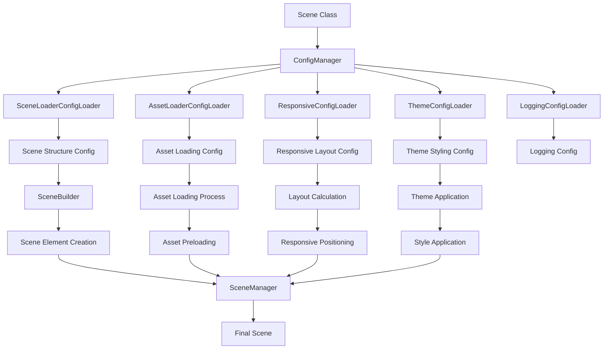

# Scene Creation Flow Documentation

## Overview

This document describes the complete flow of how scenes are created in the Phaser Base Game Module, from configuration files through loaders to the final rendered scene. The system follows a configuration-driven architecture with clear separation of concerns.

## System Architecture

The scene creation system consists of five main systems working together:

1. **Scene System** - Manages scene lifecycle, transitions, and orchestration
2. **Asset System** - Manages loading and caching of game assets
3. **Game Object System** - Handles creation and management of game objects
4. **Layout System** - Manages responsive design and positioning
5. **Unit System** - Provides measurement and calculation capabilities

## Scene Creation Flow



## Detailed Flow Steps

### 1. Scene Initialization

```typescript
// Scene class extends BaseScene
export class Levis2025R3WheelScene extends BaseScene {
  constructor() {
    super('Levis2025R3WheelScene');
  }
}
```

### 2. Configuration Registration

The scene registers all its configurations through the ConfigManager:

```typescript
protected registerSceneConfigs(): void {
  this.configManager.registerSceneConfigs(
    'levis2025r3wheel',
    levis2025r3wheelLoggingConfig,      // Logging configuration
    levis2025r3wheelResponsiveConfig,   // Responsive layout configuration
    levis2025r3wheelSceneLoaderConfig,  // Scene structure configuration
    levis2025r3wheelAssetLoaderConfig,  // Asset loading configuration
    autumnThemeConfig                   // Theme styling configuration
  );
}
```

### 3. Configuration Files Structure

#### 3.1 Scene Loader Config (`levis2025r3wheel.scene_loader.config.ts`)
- Defines scene structure and game object hierarchy
- Specifies factory classes for object creation
- Contains game object properties and relationships

```typescript
export const levis2025r3wheelSceneLoaderConfig: SceneConfig = {
  sceneId: 'levis2025r3wheel',
  sceneName: 'Levis 2025 R3 Wheel Scene',
  version: '1.0.0',
  backgroundColor: '#000000',
  gameObjects: [
    {
      id: 'root-container',
      type: GameObjectType.CONTAINER,
      name: 'Root Container',
      factory: {
        className: 'Container',
        createMethod: 'createFromConfig',
      },
      properties: { interactive: false },
      children: [...],
      parentId: undefined,
    },
  ],
  assetLoading: {
    preload: true,
    priority: ['background', 'ui', 'audio', 'effects'],
  },
};
```

#### 3.2 Asset Loader Config (`levis2025r3wheel.asset_loader.config.ts`)
- Defines asset loading strategy and priorities
- Specifies background images for different devices
- Contains asset validation and fallback rules

```typescript
export const levis2025r3wheelAssetLoaderConfig: AssetLoaderConfig = {
  basePath: '/public/assets/levis2025r3wheel',
  backgrounds: {
    desktop: {
      key: 'levis2025r3wheel-desktop-bg',
      path: '/background/desktop_16x9.png',
      type: AssetType.IMAGE,
      preload: true,
    },
    mobile: {
      key: 'levis2025r3wheel-mobile-bg',
      path: '/background/mobile_16x9.png',
      type: AssetType.IMAGE,
      preload: true,
    },
  },
  loading: {
    preload: true,
    priority: ['backgrounds', 'ui', 'audio', 'sprites'],
  },
  validation: {
    required: ['levis2025r3wheel-desktop-bg', 'levis2025r3wheel-mobile-bg'],
    optional: ['levis2025r3wheel-mobile-origin-bg'],
    fallbacks: {
      'levis2025r3wheel-desktop-bg': 'levis2025r3wheel-mobile-bg',
    },
  },
};
```

#### 3.3 Responsive Config (`levis2025r3wheel.responsive.config.ts`)
- Defines responsive behavior across different screen sizes
- Contains breakpoint-specific layouts
- Manages positioning and styling for different devices

```typescript
export const levis2025r3wheelResponsiveConfig: ResponsiveConfig = {
  default: [
    {
      id: 'root-container',
      breakpointCondition: { minWidth: 0, maxWidth: undefined },
      layoutProperties: {
        maintainAspectRatio: false,
        scaleStrategy: 'stretch',
        alignment: 'center',
        positionX: 0,
        positionY: 0,
        width: 'fill',
        height: 'fill',
        backgroundColor: '#1a1a2e',
        classes: ['container-autumn', 'root-container'],
      },
    },
  ],
  responsiveSettings: {
    xs: [...], // Extra small screens
    sm: [...], // Small screens
    md: [...], // Medium screens
    lg: [...], // Large screens
    xl: [...], // Extra large screens
  },
};
```

#### 3.4 Theme Config (`levis2025r3wheel.autumn_theme.config.ts`)
- Defines color palette and styling
- Contains typography and spacing definitions
- Provides theme classes for reusable styling

```typescript
export const autumnThemeConfig: SimpleThemeConfig = {
  themeName: 'autumn',
  colors: {
    primary: { main: '#d97706', light: '#f59e0b', dark: '#b45309' },
    secondary: { main: '#550008', light: '#7f1d1d', dark: '#3f1515' },
    background: { primary: '#fef3c7', secondary: '#fde68a' },
    // ... more color definitions
  },
  typography: {
    fontFamily: { primary: 'Inter, system-ui, sans-serif' },
    fontSize: { xs: 12, sm: 14, base: 16, lg: 18, xl: 20 },
    // ... more typography definitions
  },
  themeClasses: {
    '.header-primary': {
      backgroundColor: '#550008',
      color: '#ffffff',
      padding: 16,
      borderRadiusValue: 8,
    },
    // ... more theme classes
  },
};
```

### 4. Configuration Loading Process

#### 4.1 ConfigManager Coordination
The ConfigManager coordinates all configuration loaders:

```typescript
public registerSceneConfigs(
  sceneName: string,
  loggingConfig: LoggerConfig,
  responsiveConfig: ResponsiveConfig,
  sceneConfig: SceneConfig,
  assetConfig: AssetLoaderConfig,
  themeConfig?: SimpleThemeConfig
): void {
  // Register all configs with their respective loaders
  this.loggingLoader.registerConfig(sceneName, loggingConfig);
  this.responsiveLoader.registerConfig(sceneName, responsiveConfig);
  this.sceneLoader.registerConfig(sceneName, sceneConfig);
  this.assetLoader.registerConfig(sceneName, assetConfig);
  
  if (themeConfig) {
    this.themeLoader.registerTheme(sceneName, themeConfig);
  }
}
```

#### 4.2 Scene Lifecycle Integration
The BaseScene class integrates with the configuration system:

```typescript
export abstract class BaseScene extends Phaser.Scene {
  protected configManager: ConfigManager;
  protected responsiveConfigLoader: ResponsiveConfigLoader;
  protected themeConfigLoader: ThemeConfigLoader;
  
  constructor(sceneKey: string) {
    super({ key: sceneKey });
    this.configManager = ConfigManager.getInstance();
    this.responsiveConfigLoader = ResponsiveConfigLoader.getInstance();
    this.themeConfigLoader = ThemeConfigLoader.getInstance();
  }
  
  // Abstract method for scene-specific config registration
  protected abstract registerSceneConfigs(): void;
}
```

### 5. Asset Loading Process

#### 5.1 Asset Preloading
Assets are loaded based on the asset configuration:

```typescript
// Asset loading happens in scene preload method
preload() {
  const assetConfig = this.assetLoader.loadConfig(this.getSceneName());
  
  if (assetConfig) {
    // Load background assets
    const desktopBg = assetConfig.backgrounds.desktop;
    this.load.image(desktopBg.key, assetConfig.basePath + desktopBg.path);
    
    const mobileBg = assetConfig.backgrounds.mobile;
    this.load.image(mobileBg.key, assetConfig.basePath + mobileBg.path);
  }
}
```

#### 5.2 Asset Validation
Assets are validated against the configuration:

```typescript
// Asset validation ensures required assets are available
const validation = this.assetLoader.validateAssetConfig(sceneName);
if (!validation.isValid) {
  console.error('Asset validation failed:', validation.errors);
}
```

### 6. Scene System Integration

#### 6.1 SceneBuilder Process
The SceneBuilder creates scene elements from configuration:

```typescript
// SceneBuilder creates scene elements based on scene config
create() {
  const sceneConfig = this.sceneLoader.loadConfig(this.getSceneName());
  
  if (sceneConfig) {
    // Build scene using SceneBuilder
    this.sceneBuilder.buildScene(sceneConfig);
  }
}

// SceneBuilder builds scene elements
async buildScene(config: ISceneConfig): Promise<Map<string, ISceneElement>> {
  const elements = new Map<string, ISceneElement>();
  
  // Create scene elements from configuration
  for (const elementConfig of config.gameObjects) {
    const element = await this.buildElement(elementConfig);
    if (element) {
      elements.set(element.elementId, element);
    }
  }
  
  return elements;
}
```

#### 6.2 Scene Element Creation
Scene elements integrate game objects, layout, and unit systems:

```typescript
async buildElement(elementConfig: SceneElementConfig): Promise<ISceneElement> {
  // Create game object using factory
  const gameObject = await this.createGameObject(elementConfig);
  
  // Create scene element
  const sceneElement = new SceneElement(elementConfig);
  sceneElement.setGameObject(gameObject);
  
  // Apply layout if specified
  if (elementConfig.layout) {
    await this.applyLayout(sceneElement, elementConfig.layout);
  }
  
  // Apply theme if specified
  if (elementConfig.theme) {
    await this.applyTheme(sceneElement, elementConfig.theme.themeClass);
  }
  
  // Apply responsive configuration
  if (elementConfig.responsive) {
    await this.applyResponsive(sceneElement, elementConfig.responsive.defaultBreakpoint);
  }
  
  return sceneElement;
}
```

#### 6.3 SceneManager Orchestration
The SceneManager orchestrates the entire scene lifecycle:

```typescript
// SceneManager manages scene instances and transitions
export class SceneManager implements ISceneManager {
  async createScene(sceneId: string, config: ISceneConfig): Promise<SceneInstance> {
    // Create scene instance
    const sceneInstance: SceneInstance = {
      sceneId,
      sceneConfig: config,
      sceneElements: new Map(),
      sceneState: SceneState.INITIALIZING,
      sceneBuilder: this.sceneBuilder,
      sceneCreatedTime: Date.now(),
      sceneLastUpdateTime: Date.now(),
      sceneMetadata: {}
    };
    
    // Build scene elements
    const elements = await this.sceneBuilder.buildScene(config);
    sceneInstance.sceneElements = elements;
    
    // Set scene state to active
    sceneInstance.sceneState = SceneState.ACTIVE;
    
    return sceneInstance;
  }
}
```

### 7. Responsive Layout Application

#### 7.1 Breakpoint Detection
The system detects the current breakpoint based on screen width:

```typescript
// Responsive behavior is applied based on current screen size
update() {
  const currentWidth = this.cameras.main.width;
  const responsiveConfig = this.responsiveConfigLoader.loadConfig(this.getSceneName());
  
  if (responsiveConfig) {
    const currentBreakpoint = ResponsiveConfigLoader.getCurrentBreakpointKey(
      responsiveConfig, 
      currentWidth
    );
    
    if (currentBreakpoint !== this.currentBreakpoint) {
      this.applyResponsiveLayout(responsiveConfig, currentBreakpoint);
      this.currentBreakpoint = currentBreakpoint;
    }
  }
}
```

#### 7.2 Layout Application
Layout properties are applied to game objects:

```typescript
private applyResponsiveLayout(config: ResponsiveConfig, breakpoint: string) {
  const layouts = config.responsiveSettings[breakpoint];
  
  layouts.forEach(layout => {
    const gameObject = this.gameObjects.get(layout.id);
    if (gameObject) {
      // Apply layout properties
      this.applyLayoutProperties(gameObject, layout.layoutProperties);
    }
  });
}
```

### 8. Theme Application

#### 8.1 Theme Integration
Themes are applied to layout properties:

```typescript
// Theme is integrated with responsive layout
private applyLayoutProperties(gameObject: Phaser.GameObjects.GameObject, properties: any) {
  // Apply theme classes if specified
  if (properties.classes) {
    properties = ResponsiveConfigLoader.applyThemeToLayout(properties);
  }
  
  // Apply properties to game object
  Object.entries(properties).forEach(([key, value]) => {
    if (key in gameObject) {
      (gameObject as any)[key] = value;
    }
  });
}
```

#### 8.2 Theme Class Application
Theme classes provide reusable styling:

```typescript
// Theme classes are applied to layout properties
public static applyThemeToLayout(layoutProperties: IStyleProperties): IStyleProperties {
  const theme = ThemeConfigLoader.getInstance().getActiveTheme();
  if (!theme) return layoutProperties;
  
  let themedProperties = { ...layoutProperties };
  
  // Apply theme classes if specified
  if (layoutProperties.classes && layoutProperties.classes.length > 0) {
    themedProperties = this.applyThemeClasses(themedProperties, layoutProperties.classes, theme);
  }
  
  return themedProperties;
}
```

## System Integration Points

### 1. Scene System Integration
- **Scene Lifecycle**: Manages scene creation, activation, and destruction
- **Scene Transitions**: Handles smooth transitions between scenes
- **Scene Orchestration**: Coordinates all other systems during scene creation
- **Scene Elements**: Creates and manages composable scene elements

### 2. Asset System Integration
- **Asset Loading**: Configures which assets to load and when
- **Asset Validation**: Ensures required assets are available
- **Asset Caching**: Manages asset lifecycle and memory usage

### 3. Game Object System Integration
- **Factory Pattern**: Creates objects based on configuration
- **Object Hierarchy**: Manages parent-child relationships
- **Object Properties**: Applies configuration properties to objects

### 4. Layout System Integration
- **Responsive Design**: Adapts layout based on screen size
- **Positioning**: Calculates object positions using Unit System
- **Styling**: Applies visual properties to objects

### 5. Unit System Integration
- **Measurement**: Provides consistent measurement units
- **Calculation**: Handles positioning and sizing calculations
- **Responsive Units**: Supports responsive measurement strategies

## Configuration File Organization

```
src/runtime/scene/levis2025r3wheel/
├── levis2025r3wheel.asset_loader.config.ts    # Asset loading configuration
├── levis2025r3wheel.responsive.config.ts      # Responsive layout configuration
├── levis2025r3wheel.scene_loader.config.ts    # Scene structure configuration
├── levis2025r3wheel.autumn_theme.config.ts    # Theme styling configuration
└── levis2025r3wheel.logging.config.ts         # Logging configuration
```

## Benefits of This Architecture

1. **Separation of Concerns**: Each system has a clear responsibility
2. **Configuration-Driven**: Scenes are defined by configuration, not code
3. **Reusability**: Configurations can be shared across scenes
4. **Maintainability**: Changes to scene structure don't require code changes
5. **Responsive Design**: Built-in support for different screen sizes
6. **Theme Support**: Consistent styling across the application
7. **Factory Pattern**: Flexible object creation and management
8. **Type Safety**: Full TypeScript support with proper interfaces

## Usage Example

```typescript
// Creating a new scene is as simple as:
export class MyNewScene extends BaseScene {
  constructor() {
    super('MyNewScene');
  }
  
  protected registerSceneConfigs(): void {
    this.configManager.registerSceneConfigs(
      'myNewScene',
      myNewSceneLoggingConfig,
      myNewSceneResponsiveConfig,
      myNewSceneSceneLoaderConfig,
      myNewSceneAssetLoaderConfig,
      myNewSceneThemeConfig
    );
  }
  
  protected getSceneName(): string {
    return 'myNewScene';
  }
}
```

This architecture provides a robust, scalable, and maintainable approach to scene creation that separates configuration from implementation, making it easy to create and modify scenes without touching the core game logic.
